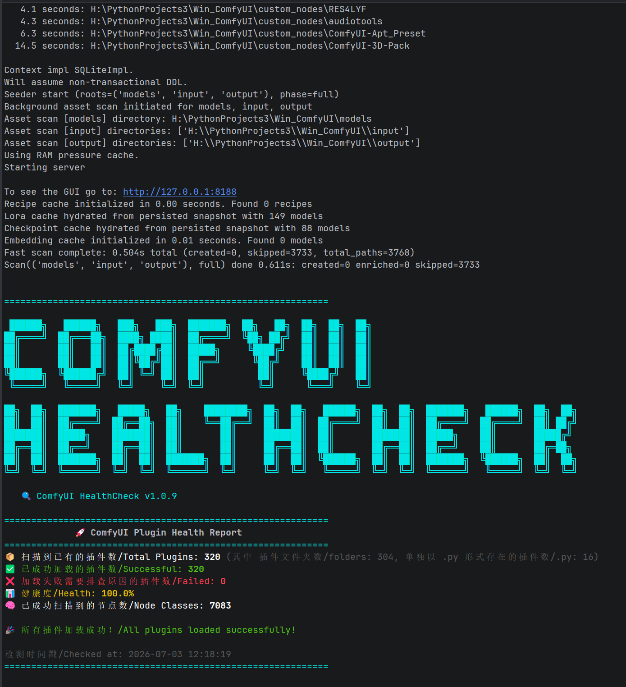

# 🔍 ComfyUI 健康检查器

轻量级 ComfyUI 插件健康监控工具，实时检测插件导入状态并输出彩色摘要报告。

## 特性

- 📦 **自动统计** 已安装插件总数（文件夹 + .py 文件）
- ✅ **检测导入成功** 通过实时日志捕获
- ❌ **列出失败插件** 并显示完整路径便于排查
- 📊 **健康度百分比** 计算
- 🧠 **节点类总数** 统计
- 🎨 **彩色控制台输出**（ANSI 颜色）
- ⏱️ **延迟报告**（等所有插件加载完成后）

## 安装

### 方法一：ComfyUI Manager（推荐）
1. 打开 ComfyUI Manager
2. 点击 "Custom Nodes Manager"
3. 搜索 "HealthCheck"
4. 安装并重启

### 方法二：Git Clone
```bash
cd ComfyUI/custom_nodes
git clone https://github.com/love530love/ComfyUI-HealthCheck.git
```

### 方法三：手动安装
1. 下载 `ComfyUI_HealthCheck.py`
2. 复制到 `ComfyUI/custom_nodes/`
3. 重启 ComfyUI

## 使用说明

无需配置。ComfyUI 启动后查看控制台输出即可。

## 效果展示

### 全部插件加载成功（健康度 100%）



```
============================================================

 ██████╗   ██████╗   ███╗   ███╗  ███████╗  ██╗   ██╗  ██╗  ██╗  ██╗
██╔════╝  ██╔═══██╗  ████╗ ████║  ██╔════╝  ╚██╗ ██╔╝  ██║  ██║  ██║
██║       ██║   ██║  ██╔████╔██║  █████╗     ╚████╔╝   ██║  ██║  ██║
██║       ██║   ██║  ██║╚██╔╝██║  ██╔══╝      ╚██╔╝    ██║  ██║  ██║
╚██████╗  ╚██████╔╝  ██║ ╚═╝ ██║  ██║          ██║     ╚████╔╝   ██║
 ╚═════╝   ╚═════╝   ╚═╝     ╚═╝  ╚═╝          ╚═╝      ╚═══╝    ╚═╝

██╗  ██╗  ███████╗   █████╗   ██╗    ████████╗  ██╗  ██╗   ██████╗  ██╗  ██╗  ███████╗   ██████╗  ██╗  ██╗
██║  ██║  ██╔════╝  ██╔══██╗  ██║    ╚══██╔══╝  ██║  ██║  ██╔════╝  ██║  ██║  ██╔════╝  ██╔════╝  ██║ ██╔╝
███████║  █████╗    ███████║  ██║       ██║     ███████║  ██║       ███████║  █████╗    ██║       █████╔╝
██╔══██║  ██╔══╝    ██╔══██║  ██║       ██║     ██╔══██║  ██║       ██╔══██║  ██╔══╝    ██║       ██╔═██╗
██║  ██║  ███████╗  ██║  ██║  ███████╗  ██║     ██║  ██║  ╚██████╗  ██║  ██║  ███████╗  ╚██████╗  ██║  ██╗
╚═╝  ╚═╝  ╚══════╝  ╚═╝  ╚═╝  ╚══════╝  ╚═╝     ╚═╝  ╚═╝   ╚═════╝  ╚═╝  ╚═╝  ╚══════╝   ╚═════╝  ╚═╝  ╚═╝

   🔍 ComfyUI HealthCheck v1.0.9

============================================================
             🚀 ComfyUI Plugin Health Report
============================================================
📦 扫描到已有的插件数/Total Plugins: 320 (其中 插件文件夹数/folders: 304, 单独以 .py 形式存在的插件数/.py: 16)
✅ 已成功加载的插件数/Successful: 320
❌ 加载失败需要排查原因的插件数/Failed: 0
📊 健康度/Health: 100.0%
🧠 已成功扫描到的节点数/Node Classes: 7083

🎉 所有插件加载成功！/All plugins loaded successfully!

检测时间戳/Checked at: 2026-07-03 12:18:19
============================================================
```

### 存在插件加载失败（健康度 < 100%）


当有插件加载失败时，报告还会列出失败路径与排查提示：

```
🚨 Failed Plugins:
✗ Example-Plugin
  └─ H:\ComfyUI\custom_nodes\Example-Plugin

💡 Troubleshooting Hint:
Search the startup log above for Traceback, Cannot import, ModuleNotFoundError, or ImportError.
```

## 工作原理

1. **伪装成节点**：注册虚拟节点避免自身被标记为 IMPORT FAILED
2. **日志捕获**：临时重定向 stdout/stderr 并拦截 `logging.Handler.emit`，兼容 ComfyUI v0.27.0+
3. **延迟输出**：检测到插件导入统计后短暂等待，确保所有插件加载完成
4. **排查提示**：当插件导入失败时，提示你回看启动日志中的关键异常关键词
5. **彩色报告**：ANSI 颜色编码的控制台摘要

## 兼容性

- Windows / Linux / macOS
- Python 3.8+
- ComfyUI 0.1.0+

## 许可证

MIT License
